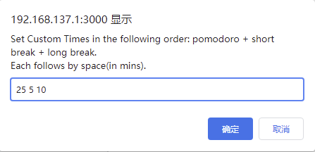
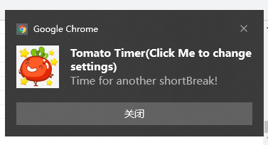

# Tomato Timer UserScript
Tomato Timer (Podomoro technique) implementation in userscript. 
- You need to have your browser opened to make the timer work.

## Tomato Timer aka Podomoro technique
Set the Pomodoro (timer) to 25 minutes
Work on the task until the timer expires; Record with an X
Take a Short Break (5 minutes)
Every four "pomodoros", take a Long Break (10 minutes)

## Features
### Customizable pomodoro and break time

### Notifications w/ phase information

